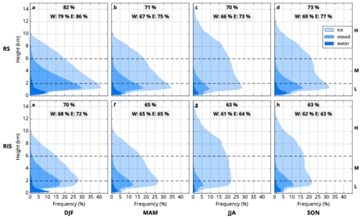

# Scientific Dataset: An analysis of the cloud environment over the Ross Sea and Ross Ice Shelf using CloudSat/CALIPSO satellites: The importance of Synoptic Forcing

Ben Jolly <<jollyb@landcareresearch.co.nz>>¹,
Peter Kuma <<peter.kuma@pg.canterbury.ac.nz>>²,
Adrian McDonald <<adrian.mcdonald@canterbury.ac.nz>>²,
Simon Parsons <<simon.parsons@canterbury.ac.nz>>²

¹Landcare Research, Lincoln, New Zealand\
²University of Canterbury, Christchurch, New Zealand

This repository contains scientific datasets and scripts for processing CloudSat
datasets and producing results presented in the paper
*An analysis of the cloud environment over the Ross Sea and Ross Ice Shelf
using CloudSat/CALIPSO satellites: The importance of Synoptic Forcing*.

## Requirements

It is recommended that the scripts are run on Linux or another unix-like
operating system. Most scripts are written in the Python programming language.
Some of the scripts are to be run on the [Spark](https://spark.apache.org/)
cluster computing platform.
Note that Spark does not require cluster deployment, it works equally well
when run locally on a single machine with 4 GB RAM or more.

For running on Windows we recommended the
[Anaconda Python distribution](https://www.continuum.io/downloads).

The following programs need to be installed:

- Spark >= 2.0.1
- Python 2.7

**Note:** On most Linux distributions these can be found in the package manager.

Python libraries:

- numpy == 1.11.2
- matplotlib == 1.5.3
- pytz == 2016.7
- h5py == 2.2.1
- dpath == 1.4.0
- ccplot == 1.5.2

To install the libraries with the python package manager (PIP) in a Python
virtual environment (virtualenv):

    virtualenv env
    . env/bin/activate
    pip install -r requirements.txt

Optional (needed only for generating map in Figure 1):

- [R](https://www.r-project.org/)

## Source Datasets

In order to run the scripts the following products should be available
on your file system:

- [CloudSat 2B-CLDCLASS-LIDAR P_R04 products (2007-2010)](http://www.cloudsat.cira.colostate.edu/data-products/level-2b/2b-cldclass?term=25)
- **Optional:** [CloudSat 2B-GEOPROF-LIDAR P2_R04 products (2006-2011)](http://www.cloudsat.cira.colostate.edu/data-products/level-2b/2b-geoprof-lidar?term=48)

You can download the complete datasets from the
CloudSat DPC FTP server
at [ftp://ftp.cloudsat.cira.colostate.edu](ftp://ftp.cloudsat.cira.colostate.edu)
after creating an account on [CloudSat DPC](http://www.cloudsat.cira.colostate.edu/).

## Figures and Tables

The following sections list scripts names used to produce figures and tables
in the paper. Please see the reference section below for a full description
of the scripts.

**Note:** This repository also contains scripts which may
be useful for additional analysis, but were not used directly to produce
results presented in the paper.

### Figure 1

Topographic map of the RIS and Ross Sea showing boundary of the study area
(thick blue line) and border between the RIS and Ross Sea sectors. (Map is based
on the SCAR Antarctic Digital Database.)

**Scripts:** [map.R](scripts/map.R)

### Figure 2

Mean vertical profiles of cumulative cloud occurrence for different cloud phases
derived from 2B-CLDCLASS-LIDAR data for the Ross Sea (a–d) and Ross Ice Shelf
regions (e–h) for different seasons.

**Scripts:** [ross_area_files.py](scripts/ross_area_files.py), [extract_area.py](scripts/extract_area.py), [cloud_incidence.py](scripts/cloud_incidence.py),
[plot_cloud_incidence_summary_by_phase.py](plot_cloud_incidence_summary_by_phase.py)

### Figure 3

Mean vertical profiles of cumulative cloud occurrence for different cloud phases
derived from 2B-CLDCLASS-LIDAR data for the Ross Sea (a–e) and Ross Ice Shelf
regions (f–j) for the Coggins regimes.

**Scripts:** [ross_area_files.py](scripts/ross_area_files.py), [extract_area.py](scripts/extract_area.py), [cloud_incidence.py](scripts/cloud_incidence.py),
[plot_cloud_incidence_summary_by_phase.py](plot_cloud_incidence_summary_by_phase.py)

### Figure 4

Distribution of the number of cloud layers over the Ross Sea and Ross Ice Shelf
for all cases, the Coggins regimes and season.

**Scripts:** [ross_area_files.py](scripts/ross_area_files.py), [extract_area.py](scripts/extract_area.py), [cloud_layers_hist.py](scripts/cloud_layers_hist.py), [plot_cloud_layers_hist.py](scripts/cloud_layers_hist.py)

### Figure 5

Percent fraction of cloud types over the Ross Sea and Ross Ice Shelf for all
cases, the Coggins regimes and seasons. The cloud types are identified in
Table 1.

**Scripts:** [ross_area_files.py](scripts/ross_area_files.py), [extract_area.py](scripts/extract_area.py), [cloud_types_hist_int.py](scripts/cloud_types_hist_int.py) [plot_cloud_types_hist_int.py](scripts/plot_cloud_types_hist_int.py)

### Figure 6

Joint histogram of the cloud top height vs. geometric cloud thickness over the Ross Sea and RIS for the entire year on a logarithmic scale (a, f) and the difference from the annual mean over the respective region (RS and RIS) for each season on a linear scale (b-e, g-j).

**Scripts:** [ross_area_files.py](scripts/ross_area_files.py), [extract_area.py](scripts/extract_area.py), [cloud_top_thickness_hist.py](scripts/cloud_top_thickness_hist.py), [plot_cloud_top_thickness_composite.py](scripts/plot_cloud_top_thickness_composite.py)

### Figure 7

Joint histogram of the cloud top height vs. geometric cloud thickness over the Ross Sea and RIS for the entire year on a logarithmic scale (a, f) and the difference from the annual mean over the respective region (RS and RIS) for each Coggins regime on a linear scale (b-e, g-j).

**Scripts:** [ross_area_files.py](scripts/ross_area_files.py), [extract_area.py](scripts/extract_area.py), [cloud_top_thickness_hist.py](scripts/cloud_top_thickness_hist.py), [plot_cloud_top_thickness_composite.py](scripts/plot_cloud_top_thickness_composite.py)

### Table 2

The relative frequency of occurrence of the Coggins regimes annually and
seasonally in the observational data (%). Values for seasons are normalized so
that rows sum to 100 %.

**Scripts:** [ross_area_files.py](scripts/ross_area_files.py), [extract_area.py](scripts/extract_area.py), [regime_season_hist.py](regime_season_hist.py), [print_regime_season_table.py](scripts/print_regime_season_table.py)

## Repository Contents

- `config` - configuration files
- `doc` - documents
- `img` - figure images
- `lib` - additional python modules used by the scripts
- `out` - output files
- `scripts` - data processing and plotting scripts

## Reference

Use `spark-submit scripts/<script>.py --help` for more information about how
to submit the scripts.

### ross_area_files.py

Output a list of CloudSat HDF-EOS2 files containing data over the
Ross Sea/Ross Ice Shelf area.

    spark-submit scripts/ross_area_files.py '/data/datasets/cloudsat/2b-geoprof-lidar/*/*/*.zip' 2>/dev/null > out/ross_area_files
    spark-submit scripts/ross_area_files.py '/data/datasets/cloudsat/2b-cldclass-lidar.p_r04/*/*/*.zip' 2>/dev/null > out/ross_area_cldclass_files

### extract_area.py

Extract profile columns from CloudSat HDF-EOS2 files in a given area.

    spark-submit scripts/extract_area.py -o out/ross_sea.h5 -a ross_sea -f out/ross_area_files 2>/dev/null
    spark-submit scripts/extract_area.py -o out/ross_ice_shelf.h5 -a ross_ice_shelf -f out/ross_area_files 2>/dev/null

    spark-submit scripts/extract_area.py -o out/ross_sea_cldclass.h5 -p 2b-cldclass-lidar -a ross_sea -f out/ross_area_cldclass_files 2>/dev/null
    spark-submit scripts/extract_area.py -o out/ross_ice_shelf_cldclass.h5 -p 2b-cldclass-lidar -a ross_ice_shelf -f out/ross_area_cldclass_files 2>/dev/null

### cloud_top_hist.py

Produce a histogram of the topmost cloud top height.

    spark-submit scripts/cloud_top_hist.py -t "Cloud top (Ross Sea, 2006-2011, 2B-GEOPROF-LIDAR)" -o out/cloud_top_hist_rs.pdf out/ross_sea.h5 2>/dev/null
    spark-submit scripts/cloud_top_hist.py -t "Cloud top (Ross Ice Shelf, 2006-2011, 2B-GEOPROF-LIDAR)" -o out/cloud_top_hist_ris.pdf out/ross_ice_shelf.h5 2>/dev/null
    spark-submit scripts/cloud_top_hist.py -t "Cloud top (Ross Sea, 2006-2011, 2B-GEOPROF-LIDAR, CPR)" -i 1 -o out/cloud_top_hist_rs_cpr.pdf out/ross_sea.h5 2>/dev/null
    spark-submit scripts/cloud_top_hist.py -t "Cloud top (Ross Sea, 2006-2011, 2B-GEOPROF-LIDAR, CALIOP)" -i 2 -o out/cloud_top_hist_rs_caliop.pdf out/ross_sea.h5 2>/dev/null
    spark-submit scripts/cloud_top_hist.py -t "Cloud top (Ross Ice Shelf, 2006-2011, 2B-GEOPROF-LIDAR, CPR)" -i 1 -o out/cloud_top_hist_ris_cpr.pdf out/ross_ice_shelf.h5 2>/dev/null
    spark-submit scripts/cloud_top_hist.py -t "Cloud top (Ross Ice Shelf, 2006-2011, 2B-GEOPROF-LIDAR, CALIOP)" -i 2 -o out/cloud_top_hist_ris_caliop.pdf out/ross_ice_shelf.h5 2>/dev/null

    spark-submit scripts/cloud_top_hist.py -t "Cloud top (Ross Sea, 2007-2010, 2B-CLDCLASS-LIDAR)" -o out/cloud_top_hist_rs_cldclass.pdf out/ross_sea_cldclass.h5 2>/dev/null
    spark-submit scripts/cloud_top_hist.py -t "Cloud top (Ross Ice Shelf, 2007-2010, 2B-CLDCLASS-LIDAR)" -o out/cloud_top_hist_ris_cldclass.pdf out/ross_ice_shelf_cldclass.h5 2>/dev/null

    for regime in wnc snc ras wsc ws; do
        spark-submit scripts/cloud_top_hist.py -t "Cloud top (Ross Sea, ${regime^^}, 2006-2011, 2B-GEOPROF-LIDAR)" -o "out/cloud_top_hist_rs_$regime.pdf" -r "$regime" out/ross_sea.h5 2>/dev/null
    done

    for regime in wnc snc ras wsc ws; do
        spark-submit scripts/cloud_top_hist.py -t "Cloud top (Ross Ice Shelf, ${regime^^}, 2006-2011, 2B-GEOPROF-LIDAR)" -o "out/cloud_top_hist_ris_$regime.pdf" -r "$regime" out/ross_ice_shelf.h5 2>/dev/null
    done

    for regime in wnc snc ras wsc ws; do
        spark-submit scripts/cloud_top_hist.py -t "Cloud top (Ross Sea, ${regime^^}, 2006-2011, 2B-CLDCLASS-LIDAR)" -o "out/cloud_top_hist_rs_${regime}_cldclass.pdf" -r "$regime" out/ross_sea_cldclass.h5 2>/dev/null
    done

    for regime in wnc snc ras wsc ws; do
        spark-submit scripts/cloud_top_hist.py -t "Cloud top (Ross Ice Shelf, ${regime^^}, 2006-2011, 2B-CLDCLASS-LIDAR)" -o "out/cloud_top_hist_ris_${regime}_cldclass.pdf" -r "$regime" out/ross_ice_shelf_cldclass.h5 2>/dev/null
    done

### profile_sample.py

Plot a profile sample.

    spark-submit scripts/profile_sample.py -o out/profile_sample_rs.pdf out/ross_sea.h5 2>/dev/null
    spark-submit scripts/profile_sample.py -o out/profile_sample_ris.pdf out/ross_ice_shelf.h5 2>/dev/null

### cloud_top_base_scatter.py

Plot cloud top/cloud base scatter plot from a sample of data.

    spark-submit scripts/cloud_top_base_scatter.py -t 'Cloud top/base scatter plot (Ross Sea, 2B-GEOPROF-LIDAR)' -o out/cloud_top_base_scatter_rs.png out/ross_sea.h5 2>/dev/null
    spark-submit scripts/cloud_top_base_scatter.py -t 'Cloud top/base scatter plot (Ross Ice Shelf, 2B-GEOPROF-LIDAR)' -o out/cloud_top_base_scatter_ris.png out/ross_ice_shelf.h5 2>/dev/null

    spark-submit scripts/cloud_top_base_scatter.py -t 'Cloud top/base scatter plot (Ross Sea, 2B-CLDCLASS-LIDAR)' -o out/cloud_top_base_scatter_rs_cldclass.png out/ross_sea_cldclass.h5 2>/dev/null
    spark-submit scripts/cloud_top_base_scatter.py -t 'Cloud top/base scatter plot (Ross Ice Shelf, 2B-CLDCLASS-LIDAR)' -o out/cloud_top_base_scatter_ris_cldclass.png out/ross_ice_shelf_cldclass.h5 2>/dev/null

### cloud_incidence.py

Produce cloud incidence histogram.

    spark-submit scripts/cloud_incidence.py out/ross_sea.h5 -o out/cloud_incidence_rs.h5 2>/dev/null
    spark-submit scripts/cloud_incidence.py -n 0 out/ross_sea.h5 -o out/cloud_incidence_rs_night.h5 2>/dev/null
    spark-submit scripts/cloud_incidence.py -n 1 out/ross_sea.h5 -o out/cloud_incidence_rs_day.h5 2>/dev/null
    spark-submit scripts/cloud_incidence.py out/ross_ice_shelf.h5 -o out/cloud_incidence_ris.h5 2>/dev/null
    spark-submit scripts/cloud_incidence.py -n 0 out/ross_ice_shelf.h5 -o out/cloud_incidence_ris_night.h5 2>/dev/null
    spark-submit scripts/cloud_incidence.py -n 1 out/ross_ice_shelf.h5 -o out/cloud_incidence_ris_day.h5 2>/dev/null

    spark-submit scripts/cloud_incidence.py -p 2b-cldclass-lidar out/ross_sea_cldclass.h5 -o out/cloud_incidence_rs_cldclass.h5 2>/dev/null
    spark-submit scripts/cloud_incidence.py -p 2b-cldclass-lidar out/ross_sea_cldclass.h5 -a ross_sea_east -o out/cloud_incidence_rs-e_cldclass.h5 2>/dev/null
    spark-submit scripts/cloud_incidence.py -p 2b-cldclass-lidar out/ross_sea_cldclass.h5 -a ross_sea_west -o out/cloud_incidence_rs-w_cldclass.h5 2>/dev/null
    spark-submit scripts/cloud_incidence.py -p 2b-cldclass-lidar out/ross_ice_shelf_cldclass.h5 -o out/cloud_incidence_ris_cldclass.h5 2>/dev/null
    spark-submit scripts/cloud_incidence.py -p 2b-cldclass-lidar out/ross_ice_shelf_cldclass.h5 -a ross_ice_shelf_east -o out/cloud_incidence_ris-e_cldclass.h5 2>/dev/null\
    spark-submit scripts/cloud_incidence.py -p 2b-cldclass-lidar out/ross_ice_shelf_cldclass.h5 -a ross_ice_shelf_west -o out/cloud_incidence_ris-w_cldclass.h5 2>/dev/null

    for regime in wnc snc ras wsc ws; do
        spark-submit scripts/cloud_incidence.py -p 2b-cldclass-lidar -r "$regime" out/ross_sea_cldclass.h5 -o "out/cloud_incidence_rs_${regime}_cldclass.h5" 2>/dev/null
        spark-submit scripts/cloud_incidence.py -p 2b-cldclass-lidar -r "$regime" out/ross_sea_cldclass.h5 -a ross_sea_east -o "out/cloud_incidence_rs-e_${regime}_cldclass.h5" 2>/dev/null
        spark-submit scripts/cloud_incidence.py -p 2b-cldclass-lidar -r "$regime" out/ross_sea_cldclass.h5 -a ross_sea_west -o "out/cloud_incidence_rs-w_${regime}_cldclass.h5" 2>/dev/null
        spark-submit scripts/cloud_incidence.py -p 2b-cldclass-lidar -r "$regime" out/ross_ice_shelf_cldclass.h5 -o "out/cloud_incidence_ris_${regime}_cldclass.h5" 2>/dev/null
        spark-submit scripts/cloud_incidence.py -p 2b-cldclass-lidar -r "$regime" out/ross_ice_shelf_cldclass.h5 -a ross_ice_shelf_east -o "out/cloud_incidence_ris-e_${regime}_cldclass.h5" 2>/dev/null
        spark-submit scripts/cloud_incidence.py -p 2b-cldclass-lidar -r "$regime" out/ross_ice_shelf_cldclass.h5 -a ross_ice_shelf_west -o "out/cloud_incidence_ris-w_${regime}_cldclass.h5" 2>/dev/null
    done

    for season in djf mam jja son; do
        spark-submit scripts/cloud_incidence.py -p 2b-cldclass-lidar -s "$season" out/ross_sea_cldclass.h5 -o "out/cloud_incidence_rs_${season}_cldclass.h5" 2>/dev/null
        spark-submit scripts/cloud_incidence.py -p 2b-cldclass-lidar -s "$season" out/ross_sea_cldclass.h5 -a ross_sea_east -o "out/cloud_incidence_rs-e_${season}_cldclass.h5" 2>/dev/null
        spark-submit scripts/cloud_incidence.py -p 2b-cldclass-lidar -s "$season" out/ross_sea_cldclass.h5 -a ross_sea_west -o "out/cloud_incidence_rs-w_${season}_cldclass.h5" 2>/dev/null
        spark-submit scripts/cloud_incidence.py -p 2b-cldclass-lidar -s "$season" out/ross_ice_shelf_cldclass.h5 -o "out/cloud_incidence_ris_${season}_cldclass.h5" 2>/dev/null
        spark-submit scripts/cloud_incidence.py -p 2b-cldclass-lidar -s "$season" out/ross_ice_shelf_cldclass.h5 -a ross_ice_shelf_east -o "out/cloud_incidence_ris-e_${season}_cldclass.h5" 2>/dev/null
        spark-submit scripts/cloud_incidence.py -p 2b-cldclass-lidar -s "$season" out/ross_ice_shelf_cldclass.h5 -a ross_ice_shelf_west -o "out/cloud_incidence_ris-w_${season}_cldclass.h5" 2>/dev/null
    done

### plot_cloud_incidence.py

Plot cloud incidence histogram.

    python scripts/plot_cloud_incidence.py -t "Cloud incidence (Ross Sea, 2006-2011, 2B-GEOPROF-LIDAR)" -o out/cloud_incidence_rs.png out/cloud_incidence_rs.h5
    python scripts/plot_cloud_incidence.py -t "Cloud incidence (Ross Sea, 2006-2011, 2B-GEOPROF-LIDAR, night)" -o out/cloud_incidence_rs_night.png out/cloud_incidence_rs_night.h5
    python scripts/plot_cloud_incidence.py -t "Cloud incidence (Ross Sea, 2006-2011, 2B-GEOPROF-LIDAR, day)" -o out/cloud_incidence_rs_day.png out/cloud_incidence_rs_day.h5
    python scripts/plot_cloud_incidence.py -t "Cloud incidence (Ross Ice Shelf, 2006-2011, 2B-GEOPROF-LIDAR)" -o out/cloud_incidence_ris.png out/cloud_incidence_ris.h5
    python scripts/plot_cloud_incidence.py -t "Cloud incidence (Ross Ice Shelf, 2006-2011, 2B-GEOPROF-LIDAR, night)" -o out/cloud_incidence_ris_night.png out/cloud_incidence_ris_night.h5
    python scripts/plot_cloud_incidence.py -t "Cloud incidence (Ross Ice Shelf, 2006-2011, 2B-GEOPROF-LIDAR, day)" -o out/cloud_incidence_ris_day.png out/cloud_incidence_ris_day.h5

    python scripts/plot_cloud_incidence.py -t "Cloud incidence (Ross Sea, 2007-2010, 2B-CLDCLASS-LIDAR)" -o out/cloud_incidence_rs_cldclass.png out/cloud_incidence_rs_cldclass.h5
    python scripts/plot_cloud_incidence.py -t "Cloud incidence (Ross Ice Shelf, 2007-2010, 2B-CLDCLASS-LIDAR)" -o out/cloud_incidence_ris_cldclass.png out/cloud_incidence_ris_cldclass.h5

    for regime in wnc snc ras wsc ws; do
        python scripts/plot_cloud_incidence.py -t "Cloud incidence (Ross Sea, ${regime^^}, 2007-2010, 2B-CLDCLASS-LIDAR)" -o out/cloud_incidence_rs_${regime}_cldclass.png out/cloud_incidence_rs_cldclass.h5
    done

    for regime in wnc snc ras wsc ws; do
        python scripts/plot_cloud_incidence.py -t "Cloud incidence (Ross Ice Shelf, ${regime^^}, 2007-2010, 2B-CLDCLASS-LIDAR)" -o out/cloud_incidence_ris_${regime}_cldclass.png out/cloud_incidence_ris_${regime}_cldclass.h5
    done

### plot_cloud_incidence_by_type.py

Plot cloud incidence by type histogram.

    python scripts/plot_cloud_incidence_by_type.py -t "Cloud incidence by type (Ross Sea, 2007-2010, 2B-CLDCLASS-LIDAR)" -o out/cloud_incidence_by_type_rs_cldclass.png out/cloud_incidence_rs_cldclass.h5
    python scripts/plot_cloud_incidence_by_type.py -t "Cloud incidence by type (Ross Ice Shelf, 2007-2010, 2B-CLDCLASS-LIDAR)" -o out/cloud_incidence_by_type_ris_cldclass.png out/cloud_incidence_ris_cldclass.h5

    for regime in wnc snc ras wsc ws; do
        python scripts/plot_cloud_incidence_by_type.py -t "Cloud incidence by type (Ross Sea, ${regime^^}, 2007-2010, 2B-CLDCLASS-LIDAR)" -o out/cloud_incidence_by_type_rs_${regime}_cldclass.png out/cloud_incidence_rs_${regime}_cldclass.h5
    done

    for regime in wnc snc ras wsc ws; do
        python scripts/plot_cloud_incidence_by_type.py -t "Cloud incidence by type (Ross Ice Shelf, ${regime^^}, 2007-2010, 2B-CLDCLASS-LIDAR)" -o out/cloud_incidence_by_type_ris_${regime}_cldclass.png out/cloud_incidence_ris_${regime}_cldclass.h5
    done

    for season in djf mam jja son; do
        python scripts/plot_cloud_incidence_by_type.py -t "Cloud incidence by type (Ross Sea, ${season^^}, 2007-2010, 2B-CLDCLASS-LIDAR)" -o out/cloud_incidence_by_type_rs_${season}_cldclass.png out/cloud_incidence_rs_${season}_cldclass.h5
    done

    for season in djf mam jja son; do
        python scripts/plot_cloud_incidence_by_type.py -t "Cloud incidence by type (Ross Ice Shelf, ${season^^}, 2007-2010, 2B-CLDCLASS-LIDAR)" -o out/cloud_incidence_by_type_ris_${season}_cldclass.png out/cloud_incidence_ris_${season}_cldclass.h5
    done

### plot_cloud_incidence_by_phase.py

Plot cloud incidence by phase histogram.

    python scripts/plot_cloud_incidence_by_phase.py -t "Cloud incidence by phase (Ross Sea, 2007-2010, 2B-CLDCLASS-LIDAR)" -o out/cloud_incidence_by_phase_rs_cldclass.png out/cloud_incidence_rs_cldclass.h5
    python scripts/plot_cloud_incidence_by_phase.py -t "Cloud incidence by phase (Ross Ice Shelf, 2007-2010, 2B-CLDCLASS-LIDAR)" -o out/cloud_incidence_by_phase_ris_cldclass.png out/cloud_incidence_ris_cldclass.h5

    for regime in wnc snc ras wsc ws; do
        python scripts/plot_cloud_incidence_by_phase.py -t "Cloud incidence by phase (Ross Sea, ${regime^^}, 2007-2010, 2B-CLDCLASS-LIDAR)" -o out/cloud_incidence_by_phase_rs_${regime}_cldclass.png out/cloud_incidence_rs_${regime}_cldclass.h5
    done

    for regime in wnc snc ras wsc ws; do
        python scripts/plot_cloud_incidence_by_phase.py -t "Cloud incidence by phase (Ross Ice Shelf, ${regime^^}, 2007-2010, 2B-CLDCLASS-LIDAR)" -o out/cloud_incidence_by_phase_ris_${regime}_cldclass.png out/cloud_incidence_ris_${regime}_cldclass.h5
    done

    for season in djf mam jja son; do
        python scripts/plot_cloud_incidence_by_phase.py -t "Cloud incidence by phase (Ross Sea, ${season^^}, 2007-2010, 2B-CLDCLASS-LIDAR)" -o out/cloud_incidence_by_phase_rs_${season}_cldclass.png out/cloud_incidence_rs_${season}_cldclass.h5
    done

    for season in djf mam jja son; do
        python scripts/plot_cloud_incidence_by_phase.py -t "Cloud incidence by phase (Ross Ice Shelf, ${season^^}, 2007-2010, 2B-CLDCLASS-LIDAR)" -o out/cloud_incidence_by_phase_ris_${season}_cldclass.png out/cloud_incidence_ris_${season}_cldclass.h5
    done

### cloud_incidence_map_8000_8300

Calculate cloud incidence map for two heights (8000 m and 8300 m).

    spark-submit scripts/cloud_incidence_map_8000_8300.py -o out/cloud_incidence_map_8000_8300.h5 '/data/datasets/cloudsat/2b-geoprof-lidar/*/*/*.zip' 2>/dev/null

### plot_correction_factor.py

Plot a map of cloud incidence correction factor (cloud incidence at 8000 m over cloud incidence at
8300 m).

    python scripts/plot_correction_factor.py out/cloud_incidence_map_8000_8300.h5 -t 'Cloud incidence correction factor 8000 m vs. 8300 m' -o out/correction_factor.pdf

    python scripts/plot_correction_factor.py out/cloud_incidence_map_8000_8300_djf.h5 -t 'Cloud incidence correction factor 8000 m vs. 8300 m (DJF)' -o out/correction_factor_djf.pdf

    python scripts/plot_correction_factor.py out/cloud_incidence_map_8000_8300_jja.h5 -t 'Cloud incidence correction factor 8000 m vs. 8300 m (JJA)' -o out/correction_factor_jja.pdf

### plot_regimes.py

Plot regimes distribution by month.

    python scripts/plot_regimes.py -t 'Regimes distribution by month (2007-2010)' -o out/regimes.pdf

### plot_cloud_incidence_summary_by_phase.py

Plot cloud incidence summary by phase.

    python scripts/plot_cloud_incidence_summary_by_phase.py -t 'Clouds incidence by phase (Ross Sea, 2007-2010, 2B-CLDCLASS-LIDAR)' -l DJF,MAM,JJA,SON -o out/cloud_incidence_summary_by_phase_rs_seasons.png out/cloud_incidence_rs_djf_cldclass.h5 out/cloud_incidence_rs_mam_cldclass.h5 out/cloud_incidence_rs_jja_cldclass.h5 out/cloud_incidence_rs_son_cldclass.h5

    python scripts/plot_cloud_incidence_summary_by_phase.py -t 'Clouds incidence by phase (Ross Ice Shelf, 2007-2010, 2B-CLDCLASS-LIDAR)' -l DJF,MAM,JJA,SON -o out/cloud_incidence_summary_by_phase_ris_seasons.png out/cloud_incidence_ris_djf_cldclass.h5 out/cloud_incidence_ris_mam_cldclass.h5 out/cloud_incidence_ris_jja_cldclass.h5 out/cloud_incidence_ris_son_cldclass.h5

    python scripts/plot_cloud_incidence_summary_by_phase.py -t 'Clouds incidence by phase (Ross Sea, 2007-2010, 2B-CLDCLASS-LIDAR)' -l WNC,SNC,RAS,WSC,WS -o out/cloud_incidence_summary_by_phase_rs_regimes.png out/cloud_incidence_rs_wnc_cldclass.h5 out/cloud_incidence_rs_snc_cldclass.h5 out/cloud_incidence_rs_ras_cldclass.h5 out/cloud_incidence_rs_wsc_cldclass.h5 out/cloud_incidence_rs_ws_cldclass.h5

    python scripts/plot_cloud_incidence_summary_by_phase.py -t 'Clouds incidence by phase (Ross Ice Shelf, 2007-2010, 2B-CLDCLASS-LIDAR)' -l WNC,SNC,RAS,WSC,WS -o out/cloud_incidence_summary_by_phase_ris_regimes.png out/cloud_incidence_ris_wnc_cldclass.h5 out/cloud_incidence_ris_snc_cldclass.h5 out/cloud_incidence_ris_ras_cldclass.h5 out/cloud_incidence_ris_wsc_cldclass.h5 out/cloud_incidence_ris_ws_cldclass.h5

### plot_cloud_incidence_summary_by_type.py

Plot cloud incidence summary by type.

    python scripts/plot_cloud_incidence_summary_by_type.py -t 'Clouds incidence by type (Ross Sea, 2007-2010, 2B-CLDCLASS-LIDAR)' -l DJF,MAM,JJA,SON -o out/cloud_incidence_summary_by_type_rs_seasons.png out/cloud_incidence_rs_djf_cldclass.h5 out/cloud_incidence_rs_mam_cldclass.h5 out/cloud_incidence_rs_jja_cldclass.h5 out/cloud_incidence_rs_son_cldclass.h5

    python scripts/plot_cloud_incidence_summary_by_type.py -t 'Clouds incidence by type (Ross Ice Shelf, 2007-2010, 2B-CLDCLASS-LIDAR)' -l DJF,MAM,JJA,SON -o out/cloud_incidence_summary_by_type_ris_seasons.png out/cloud_incidence_ris_djf_cldclass.h5 out/cloud_incidence_ris_mam_cldclass.h5 out/cloud_incidence_ris_jja_cldclass.h5 out/cloud_incidence_ris_son_cldclass.h5

    python scripts/plot_cloud_incidence_summary_by_type.py -t 'Clouds incidence by type (Ross Sea, 2007-2010, 2B-CLDCLASS-LIDAR)' -l WNC,SNC,RAS,WSC,WS -o out/cloud_incidence_summary_by_type_rs_regimes.png out/cloud_incidence_rs_wnc_cldclass.h5 out/cloud_incidence_rs_snc_cldclass.h5 out/cloud_incidence_rs_ras_cldclass.h5 out/cloud_incidence_rs_wsc_cldclass.h5 out/cloud_incidence_rs_ws_cldclass.h5

    python scripts/plot_cloud_incidence_summary_by_type.py -t 'Clouds incidence by type (Ross Ice Shelf, 2007-2010, 2B-CLDCLASS-LIDAR)' -l WNC,SNC,RAS,WSC,WS -o out/cloud_incidence_summary_by_type_ris_regimes.png out/cloud_incidence_ris_wnc_cldclass.h5 out/cloud_incidence_ris_snc_cldclass.h5 out/cloud_incidence_ris_ras_cldclass.h5 out/cloud_incidence_ris_wsc_cldclass.h5 out/cloud_incidence_ris_ws_cldclass.h5

### plot_cloud_incidence_information_gain.py

Plot cloud incidence information gain.

    python scripts/plot_cloud_incidence_information_gain.py -t "Information gain (Ross Sea, 2007-2010, 2B-CLDCLASS)" -x phase -o out/cloud_incidence_information_gain_rs_phase.png -c data/classes_rs.json
    python scripts/plot_cloud_incidence_information_gain.py -t "Information gain (Ross Sea, 2007-2010, 2B-CLDCLASS)"  -x type -o out/cloud_incidence_information_gain_rs_type.png -c data/classes_rs.json

    python scripts/plot_cloud_incidence_information_gain.py -t "Information gain (Ross Ice Shelf, 2007-2010, 2B-CLDCLASS)"  -x phase -o out/cloud_incidence_information_gain_ris_phase.png -c config/classes_ris.json
    python scripts/plot_cloud_incidence_information_gain.py -t "Information gain (Ross Ice Shelf, 2007-2010, 2B-CLDCLASS)"  -x type -o out/cloud_incidence_information_gain_ris_type.png -c config/classes_ris.json

### plot_cloud_incidence_by_phase_multiple.py

Plot cloud incidence by phase (multiple panels).

    python scripts/plot_cloud_incidence_by_phase_multiple.py -o out/cloud_incidence_by_phase_regime.png -c config/cloud_incidence_by_phase_regime.json

    python scripts/plot_cloud_incidence_by_phase_multiple.py -o out/cloud_incidence_by_phase_season.png -c config/cloud_incidence_by_phase_season.json

### cloud_incidence_summary.py

Print fraction of cloudy profiles.

    python scripts/cloud_incidence_summary.py -o out/cloud_incidence_summary_cldclass.h5 -c config/cloud_incidence_summary_cldclass.json

    sh -c '
        for regime in wnc snc ras wsc ws; do
            echo "RS,${regime^^},$(python scripts/cloud_incidence_cloudy.py out/cloud_incidence_rs_${regime}_cldclass.h5)"
        done

        for regime in wnc snc ras wsc ws; do
            echo "RIS,${regime^^},$(python scripts/cloud_incidence_cloudy.py out/cloud_incidence_ris_${regime}_cldclass.h5)"
        done

        for season in djf mam jja son; do
            echo "RS,${season^^},$(python scripts/cloud_incidence_cloudy.py out/cloud_incidence_rs_${season}_cldclass.h5)"
        done

        for season in djf mam jja son; do
            echo "RIS,${season^^},$(python scripts/cloud_incidence_cloudy.py out/cloud_incidence_ris_${season}_cldclass.h5)"
        done
    ' > out/cloud_incidence_summary_cldclass.csv

### cloud_layers_hist.py

Cloud layers histogram.

    spark-submit scripts/cloud_layers_hist.py -o out/cloud_layers_hist_rs_cldclass.h5 out/ross_sea_cldclass.h5 2>/dev/null
    spark-submit scripts/cloud_layers_hist.py -o out/cloud_layers_hist_ris_cldclass.h5 out/ross_ice_shelf_cldclass.h5 2>/dev/null

    for regime in wnc snc ras wsc ws; do
        spark-submit scripts/cloud_layers_hist.py -o out/cloud_layers_hist_rs_${regime}_cldclass.h5 -r "$regime" out/ross_sea_cldclass.h5 2>/dev/null
    done

    for regime in wnc snc ras wsc ws; do
        spark-submit scripts/cloud_layers_hist.py -o out/cloud_layers_hist_ris_${regime}_cldclass.h5 -r "$regime" out/ross_ice_shelf_cldclass.h5 2>/dev/null
    done

    for season in djf mam jja son; do
        spark-submit scripts/cloud_layers_hist.py -o out/cloud_layers_hist_rs_${season}_cldclass.h5 -s "$season" out/ross_sea_cldclass.h5 2>/dev/null
    done

    for season in djf mam jja son; do
        spark-submit scripts/cloud_layers_hist.py -o out/cloud_layers_hist_ris_${season}_cldclass.h5 -s "$season" out/ross_ice_shelf_cldclass.h5 2>/dev/null
    done

### plot_cloud_layers_hist.py

Plot cloud layers histogram.

    python scripts/plot_cloud_layers_hist.py -o out/cloud_layers_hist_cldclass.png -c config/cloud_layers_hist_cldclass.json

    python scripts/plot_cloud_layers_hist.py -o out/cloud_layers_hist_rs_cldclass.png -c config/cloud_layers_hist_rs_cldclass.json

    python scripts/plot_cloud_layers_hist.py -o out/cloud_layers_hist_ris_cldclass.png -c config/cloud_layers_hist_ris_cldclass.json

### count.py

Count the number of profiles.

    bash -c '
        echo "RS,all,$(spark-submit scripts/count.py out/ross_sea_cldclass.h5 2>/dev/null)"
        echo "RIS,all,$(spark-submit scripts/count.py out/ross_ice_shelf_cldclass.h5 2>/dev/null)"

        for regime in wnc snc ras wsc ws; do
            echo "RS,${regime^^},$(spark-submit scripts/count.py -r "$regime" out/ross_sea_cldclass.h5 2>/dev/null)"
            echo "RS-E,${regime^^},$(spark-submit scripts/count.py -r "$regime" -a ross_sea_east out/ross_sea_cldclass.h5 2>/dev/null)"
            echo "RS-W,${regime^^},$(spark-submit scripts/count.py -r "$regime" -a ross_sea_west out/ross_sea_cldclass.h5 2>/dev/null)"
            echo "RIS,${regime^^},$(spark-submit scripts/count.py -r "$regime" out/ross_ice_shelf_cldclass.h5 2>/dev/null)"
            echo "RIS-E,${regime^^},$(spark-submit scripts/count.py -r "$regime" -a ross_ice_shelf_east out/ross_ice_shelf_cldclass.h5 2>/dev/null)"
            echo "RIS-W,${regime^^},$(spark-submit scripts/count.py -r "$regime" -a ross_ice_shelf_west out/ross_ice_shelf_cldclass.h5 2>/dev/null)"
        done

        for season in djf mam jja son; do
            echo "RS,${season^^},$(spark-submit scripts/count.py -s "$season" out/ross_sea_cldclass.h5 2>/dev/null)"
            echo "RS-E,${season^^},$(spark-submit scripts/count.py -s "$season" -a ross_sea_east out/ross_sea_cldclass.h5 2>/dev/null)"
            echo "RS-W,${season^^},$(spark-submit scripts/count.py -s "$season" -a ross_sea_west out/ross_sea_cldclass.h5 2>/dev/null)"
            echo "RIS,${season^^},$(spark-submit scripts/count.py -s "$season" out/ross_ice_shelf_cldclass.h5 2>/dev/null)"
            echo "RIS-E,${season^^},$(spark-submit scripts/count.py -s "$season" -a ross_ice_shelf_east out/ross_ice_shelf_cldclass.h5 2>/dev/null)"
            echo "RIS-W,${season^^},$(spark-submit scripts/count.py -s "$season" -a ross_ice_shelf_west out/ross_ice_shelf_cldclass.h5 2>/dev/null)"
        done
    ' > out/counts.csv

### cloud_types_hist.py

Cloud types histogram.

    spark-submit scripts/cloud_types_hist.py -o out/cloud_types_hist_rs_cldclass.h5 out/ross_sea_cldclass.h5 2>/dev/null

    for regime in wnc snc ras wsc ws; do
        spark-submit scripts/cloud_types_hist.py -o "out/cloud_types_hist_rs_${regime}_cldclass.h5" -r "$regime" out/ross_sea_cldclass.h5 2>/dev/null
    done

    for season in djf mam jja son; do
        spark-submit scripts/cloud_types_hist.py -o "out/cloud_types_hist_rs_${season}_cldclass.h5" -s "$season" out/ross_sea_cldclass.h5 2>/dev/null
    done

    spark-submit scripts/cloud_types_hist.py -o out/cloud_types_hist_ris_cldclass.h5 out/ross_ice_shelf_cldclass.h5 2>/dev/null

    for regime in wnc snc ras wsc ws; do
        spark-submit scripts/cloud_types_hist.py -o "out/cloud_types_hist_ris_${regime}_cldclass.h5" -r "$regime" out/ross_ice_shelf_cldclass.h5 2>/dev/null
    done

    for season in djf mam jja son; do
        spark-submit scripts/cloud_types_hist.py -o "out/cloud_types_hist_ris_${season}_cldclass.h5" -s "$season" out/ross_ice_shelf_cldclass.h5 2>/dev/null
    done

### plot_cloud_types_hist.py

Plot cloud types histogram.

    python scripts/plot_cloud_types_hist.py -o out/cloud_types_hist_rs_cldclass.png -c config/cloud_types_hist_rs_cldclass.json

    python scripts/plot_cloud_types_hist.py -o out/cloud_types_hist_ris_cldclass.png -c config/cloud_types_hist_ris_cldclass.json

### cloud_top_thickness_hist.py

Cloud top-thickness histogram.

    spark-submit scripts/cloud_top_thickness_hist.py -o out/cloud_top_thickness_hist_rs_cldclass.h5 out/ross_sea_cldclass.h5 2>/dev/null

    spark-submit scripts/cloud_top_thickness_hist.py -o out/cloud_top_thickness_hist_ris_cldclass.h5 out/ross_ice_shelf_cldclass.h5 2>/dev/null

    for regime in wnc snc ras wsc ws; do
        spark-submit scripts/cloud_top_thickness_hist.py -o "out/cloud_top_thickness_hist_rs_${regime}_cldclass.h5" -r "$regime" out/ross_sea_cldclass.h5 2>/dev/null
    done

    for season in djf mam jja son; do
        spark-submit scripts/cloud_top_thickness_hist.py -o "out/cloud_top_thickness_hist_rs_${season}_cldclass.h5" -s "$season" out/ross_sea_cldclass.h5 2>/dev/null
    done

    for regime in wnc snc ras wsc ws; do
        spark-submit scripts/cloud_top_thickness_hist.py -o "out/cloud_top_thickness_hist_ris_${regime}_cldclass.h5" -r "$regime" out/ross_ice_shelf_cldclass.h5 2>/dev/null
    done

    for season in djf mam jja son; do
        spark-submit scripts/cloud_top_thickness_hist.py -o "out/cloud_top_thickness_hist_ris_${season}_cldclass.h5" -s "$season" out/ross_ice_shelf_cldclass.h5 2>/dev/null
    done

### plot_cloud_top_thickness_hist.py

Plot cloud top-thickness histogram.

    python scripts/plot_cloud_top_thickness_hist.py -t "Cloud top-thickness histogram (Ross Sea, 2007-2010, 2B-CLDCLASS-LIDAR)" -o out/cloud_top_thickness_hist_rs_cldclass.pdf out/cloud_top_thickness_hist_rs_cldclass.h5

    python scripts/plot_cloud_top_thickness_hist.py -t "Cloud top-thickness histogram (Ross Ice Shelf, 2007-2010, 2B-CLDCLASS-LIDAR)" -o out/cloud_top_thickness_hist_ris_cldclass.pdf out/cloud_top_thickness_hist_ris_cldclass.h5

    for regime in wnc snc ras wsc ws; do
        python scripts/plot_cloud_top_thickness_hist.py -t "Cloud top-thickness histogram (Ross Sea, ${regime^^}, 2007-2010, 2B-CLDCLASS-LIDAR)" -o "out/cloud_top_thickness_hist_rs_${regime}_cldclass.pdf" "out/cloud_top_thickness_hist_rs_${regime}_cldclass.h5"
    done

    for season in djf mam jja son; do
        python scripts/plot_cloud_top_thickness_hist.py -t "Cloud top-thickness histogram (Ross Sea, ${season^^}, 2007-2010, 2B-CLDCLASS-LIDAR)" -o "out/cloud_top_thickness_hist_rs_${season}_cldclass.pdf" "out/cloud_top_thickness_hist_rs_${season}_cldclass.h5"
    done

    for regime in wnc snc ras wsc ws; do
        python scripts/plot_cloud_top_thickness_hist.py -t "Cloud top-thickness histogram (Ross Ice Shelf, ${regime^^}, 2007-2010, 2B-CLDCLASS-LIDAR)" -o "out/cloud_top_thickness_hist_ris_${regime}_cldclass.pdf" "out/cloud_top_thickness_hist_ris_${regime}_cldclass.h5"
    done

    for season in djf mam jja son; do
        python scripts/plot_cloud_top_thickness_hist.py -t "Cloud top-thickness histogram (Ross Ice Shelf, ${season^^}, 2007-2010, 2B-CLDCLASS-LIDAR)" -o "out/cloud_top_thickness_hist_ris_${season}_cldclass.pdf" "out/cloud_top_thickness_hist_ris_${season}_cldclass.h5"
    done

    # Relative

    for regime in wnc snc ras wsc ws; do
        python scripts/plot_cloud_top_thickness_hist.py -t "Cloud top-thickness histogram (Ross Sea, ${regime^^}, 2007-2010, 2B-CLDCLASS-LIDAR)" -o "out/cloud_top_thickness_hist_rs_${regime}_rel_cldclass.pdf" "out/cloud_top_thickness_hist_rs_${regime}_cldclass.h5" out/cloud_top_thickness_hist_rs_cldclass.h5
    done

    for season in djf mam jja son; do
        python scripts/plot_cloud_top_thickness_hist.py -t "Cloud top-thickness histogram (Ross Sea, ${season^^}, 2007-2010, 2B-CLDCLASS-LIDAR)" -o "out/cloud_top_thickness_hist_rs_${season}_rel_cldclass.pdf" "out/cloud_top_thickness_hist_rs_${season}_cldclass.h5" out/cloud_top_thickness_hist_rs_cldclass.h5
    done

    for regime in wnc snc ras wsc ws; do
        python scripts/plot_cloud_top_thickness_hist.py -t "Cloud top-thickness histogram (Ross Ice Shelf, ${regime^^}, 2007-2010, 2B-CLDCLASS-LIDAR)" -o "out/cloud_top_thickness_hist_ris_${regime}_rel_cldclass.pdf" "out/cloud_top_thickness_hist_ris_${regime}_cldclass.h5" out/cloud_top_thickness_hist_ris_cldclass.h5
    done

    for season in djf mam jja son; do
        python scripts/plot_cloud_top_thickness_hist.py -t "Cloud top-thickness histogram (Ross Ice Shelf, ${season^^}, 2007-2010, 2B-CLDCLASS-LIDAR)" -o "out/cloud_top_thickness_hist_ris_${season}_rel_cldclass.pdf" "out/cloud_top_thickness_hist_ris_${season}_cldclass.h5" out/cloud_top_thickness_hist_ris_cldclass.h5
    done

### plot_cloud_top_thickness_hist_multi.py

Plot cloud top-thickness histogram (multiple panels).

    python scripts/plot_cloud_top_thickness_hist.py -o out/cloud_top_thickness_hist.png -c config/cloud_top_thickness_hist_cldclass.json

### cloud_types_hist_int.py

Cloud types histogram (integrated)

    spark-submit scripts/cloud_types_hist_int.py -o out/cloud_types_hist_int_rs_cldclass.h5 out/ross_sea_cldclass.h5 2>/dev/null

    for regime in wnc snc ras wsc ws; do
        spark-submit scripts/cloud_types_hist_int.py -o "out/cloud_types_hist_int_rs_${regime}_cldclass.h5" -r "$regime" out/ross_sea_cldclass.h5 2>/dev/null
    done

    for season in djf mam jja son; do
        spark-submit scripts/cloud_types_hist_int.py -o "out/cloud_types_hist_int_rs_${season}_cldclass.h5" -s "$season" out/ross_sea_cldclass.h5 2>/dev/null
    done

    spark-submit scripts/cloud_types_hist_int.py -o out/cloud_types_hist_int_ris_cldclass.h5 out/ross_ice_shelf_cldclass.h5 2>/dev/null

    for regime in wnc snc ras wsc ws; do
        spark-submit scripts/cloud_types_hist_int.py -o "out/cloud_types_hist_int_ris_${regime}_cldclass.h5" -r "$regime" out/ross_ice_shelf_cldclass.h5 2>/dev/null
    done

    for season in djf mam jja son; do
        spark-submit scripts/cloud_types_hist_int.py -o "out/cloud_types_hist_int_ris_${season}_cldclass.h5" -s "$season" out/ross_ice_shelf_cldclass.h5 2>/dev/null
    done

### plot_cloud_types_hist_int.py

Plot cloud types histogram (integrated).

    python scripts/plot_cloud_types_hist_int.py -o out/cloud_types_hist_int.png -c config/cloud_types_hist_int.json

### plot_cloud_top_thickness_composite.py

Plot cloud top vs. cloud thickness composite plot.

    python scripts/plot_cloud_top_thickness_composite.py -o out/cloud_top_thickness_composite_regime -c config/cloud_top_thickness_composite_regime.json

    python scripts/plot_cloud_top_thickness_composite.py -o out/cloud_top_thickness_composite_season -c config/cloud_top_thickness_composite_season.json

### regime_season_hist.py

Regime-season histogram.

    spark-submit scripts/regime_season_hist.py -o out/regime_season_hist.h5 out/ross_sea_cldclass.h5 out/ross_ice_shelf_cldclass.h5 2>/dev/null

### print_regime_season_table.py

Print regime-season table.

    python scripts/print_regime_season_table.py out/regime_season_hist.h5

### map.R

    scripts/map.py -o out/map.pdf
